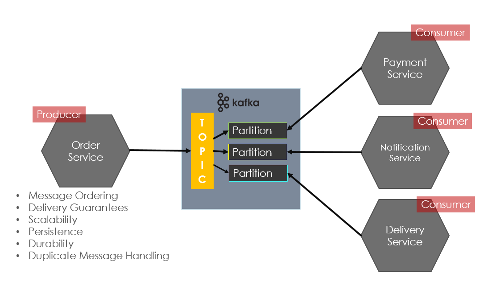
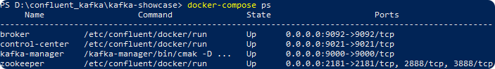
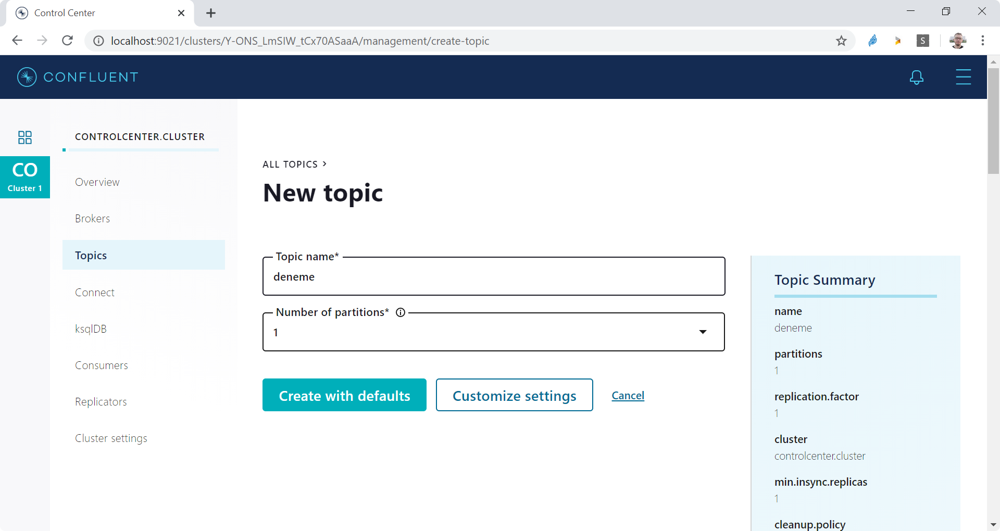
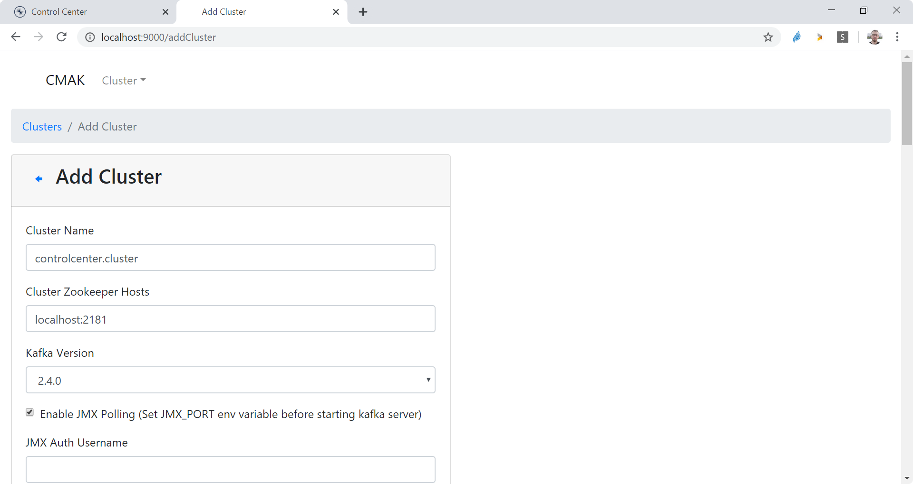
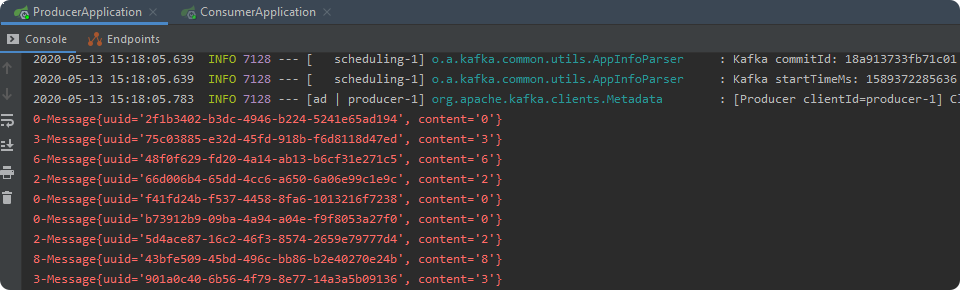
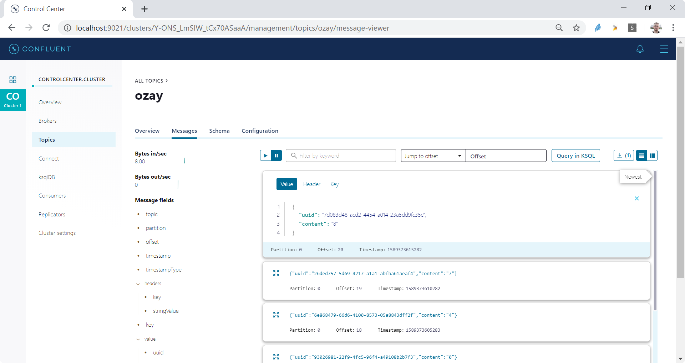
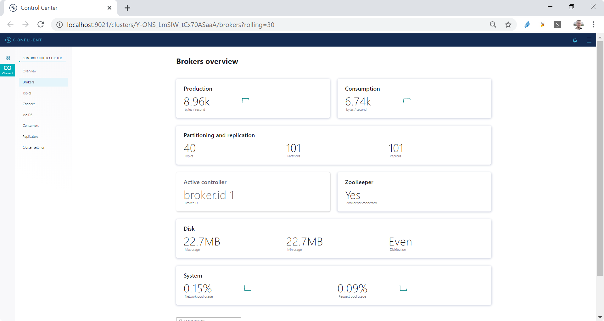
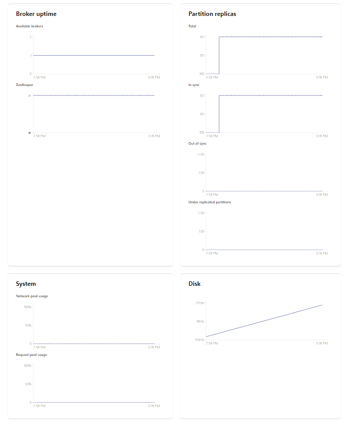

# Apache Kafka, Spring Kafka ve Docker Compose ile Lokalde Geliştirme 
Bu yazımda kafkayı geliştirme ortamınızda nasıl kolayca kullanabileceğinizi anlatıyorum.
**Apache Kafka**, hızlı, ölçeklenebilir, yüksek erişilebilir, hata toleransı, dayanıklılık v.b. özelliklere sahip bir mesajlaşma sistemidir. 
Genel anlamda Mikroservis Mimarisi gibi dağıtık uygulamalar arasındaki asenkron iletişimde (event & command based), real-time data pipeline'ları ve streaming uygulamaları oluşturmak için kullanılmaktadır.
Kafka publish-subscribe tabanlı bir mesajlaşma sunar. Böyle bir yapıda Message Broker'lar, consumer'lar, producerlar ve topic'ler yer almaktadır.
Producer'lar consumer'ların haberdar olması için belirli bir topic'e mesaj gönderir. Consumer'lar ilgilendikleri topiclere abone olurlar ve böylece bu topiclerdeki mesajları alabilmektedirler. 
Bir Servis Discovery yapısına da ihtiyac duymazlar. 
Bu yapıda Producer ve Consumer'lar birbirlerini bilmezler, tamamen decouple durumdadırlar.
Yani bir producer servis ürettiği mesajın hangi servisler tarafından tüketilmekte oluduğunu ve consumer'lar da abone oldukları mesajların hangi servisler tarafından üretildiğini bilmezler.
Message Broker, bir kuyruk yapısı sunar. Mesajlar topiclerde retention policy olarak belirtilen süre boyunca (belirtilmezsa varsayılan 1 hafta) saklanmaktadır.
Mesajlaşmanın gerçekleşmesi için producer ve consumer'ların _**aynı anda ayakta olması**_ gerekmez. örneğin producer servis göçtüğünde consumer'lar çalışmaya devam edebilir. 
Benzer şekilde bir Consumer mesajı alıp işledi ve veritabanını  update etti ancak ACK gonderemeden göctü. Bu durumda broker ACK alınmamış bir mesajı ayaktaki farklı bir consumer gondermektedir.
Eğer At Least One stratejisi kullanılıyorsa aynı mesajın işenmesi sorun oluşturabilir bu durum için consumerlarda mesajlar idompotent olarak ele alınmalıdır. 
Yani birden fazla alıp işlenmesi sorun oluşturmamalıdır. Buradaki önemli noktalardan biri **_consumer group id_**'dir. Broker aynı consumer group id'ye sahip bir consumer'a messajı alma işlemi için atar. Yani aynı consumer grubundaki consumer'lardan sadece bir tanesi mesajı alabilir.
Consumer mesaj işlemi hızı yeterli olmadığında partition'lar oluşturularak mesajların consumerlar tarafındaBuradaki önemli noktalardan biri consumer group id'dir, broker aynı consumer group id'ye sahip bir consumer'a messajı alma işlemi için atama yapar.



## Development Ortamında Kafka Kullanımı
kafka ile development ortamınızda çalışmak için Confluent tarafından hazırlanmış docker imageleri kullanan docker compose tanımını kullanıyorum.

**docker compose ile kafka clusterını ayağa kaldırmak için:**

`docker-compose up -d`

komutunu kullanabilirsiniz.

**aşağıdaki komut ile docker compose'un ayağa kaldırdığınız processesleri görebilirsiniz:**

`docker-compose ps` 



kafka kullanımına aşina değilseniz kafka quick start adımları size yardımcı olacaktır (https://kafka.apache.org/quickstart).

İsterseniz Confluent yerine yahoo tarafından sunulan Kafka Manager uygulamasını kullanabilirsiniz. Bunun için Kafka Manager'ı imajı docker-compose.yml dosyasına dahil ettim. 
## Confluent Center ve Kafka Manager
confluent center'a http://localhost:9021/ adresinden erişilebilir. Confluent centerde Cluster | Topics altında deneme isimli bir topic üretilmelidir.


Kafka Manager'a (CMAK) ise http://localhost:9000/ adresinden erişebilirsiniz:


Son olarak maven sub modules yapısında oluşturduğum **_kafka-showcase_** isimli projede yer
Producer ve Consumer uygulamalarını ayağa kaldırıp üretilen ve tüketilen mesajları konsollarından gözlemleyebilirsiniz:

## Projenin Build Edilmesi ve Çalıştırılması
`./mvnw clean package`

producer'ın çalıştırılması:

```
cd producer
mvn spring-boot:run
```


consumer'ın çalıştırılması:
```
cd consumer
mvn spring-boot:run
```


Control Center'dan Üretilen Tüketilen mesajlar ve içerikleri offset bilgilerini aşağıdaki gibi görülebilirsiniz:


Control Center'da aynı zamanda broker istatistikleri de görülebilir:






