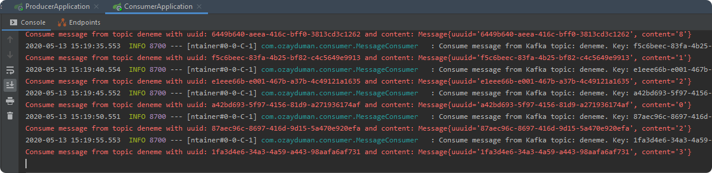

# Apache Kafka, Spring for Apache Kafka ve Docker Compose ile Lokalde Geliştirme 
Bu yazımda kafkayı geliştirme ortamınızda nasıl kolayca kullanabileceğinizi anlatıyorum.
**Apache Kafka**, hızlı, ölçeklenebilir, yüksek erişilebilir, hata toleransı, dayanıklılık v.b. özelliklere sahip bir mesajlaşma sistemidir. Genel anlamda Mikroservis Mimarisi gibi dağıtık uygulamalar arasındaki asenkron iletişimde (event & command based), real-time data pipeline’ları ve streaming uygulamaları oluşturmak için kullanılmaktadır. Kafka publish-subscribe tabanlı bir mesajlaşma sunar. Böyle bir yapıda Message Broker’lar, consumer’lar, producerlar ve topic’ler yer almaktadır. Producer’lar consumer’ların haberdar olması için belirli bir topic’e mesaj gönderir. Consumer’lar ilgilendikleri topic’lere abone olurlar ve böylece bu topic’lerdeki mesajları alabilmektedirler. Harici bir Servis Discovery yapısına da ihtiyac duymazlar. Bu yapıda Producer ve Consumer’lar birbirlerini bilmezler, tamamen decouple durumdadırlar. Yani bir producer servis, ürettiği mesajın hangi servisler tarafından tüketilmekte oluduğunu ve consumer’lar da abone oldukları mesajların hangi servisler tarafından üretildiğini bilmezler. Message Broker, bir kuyruk yapısı sunar. Mesajlar topiclerde retention policy olarak belirtilen süre boyunca (belirtilmezsa varsayılan 1 hafta) saklanmaktadır. Mesajlaşmanın gerçekleşmesi için producer ve consumer’ların **aynı anda ayakta olması** gerekmez. örneğin producer servis göçtüğünde consumer’lar çalışmaya devam edebilir. Benzer şekilde consumer servis göçtüğünde producer servisler çalışmaya devam ederler. Bir Consumer mesajı alıp işledi ve veritabanını update etti ancak ACK gönderemeden göçtü. Bu durumda broker ACK alınmamış bir mesajı ayaktaki farklı bir consumer’a göndermektedir. Eğer At Least One stratejisi kullanılıyorsa aynı mesajın işlenmesi sorun oluşturabilir. Bu durum için consumerlarda mesajlar idompotent olarak ele alınmalıdır. Yani aynı mesajın birden fazla alınıp işlenmesi sorun oluşturmamalıdır. Buradaki önemli noktalardan biri **consumer group id**’dir. Broker aynı consumer group id’ye sahip consumer’lardan sadece birini consumer olarak belirler. Yani aynı consumer grubundaki consumer’lardan sadece bir tanesi mesajı alabilir. Consumer’ın mesaj işlemi hızı yeterli olmadığında yeni partition’lar oluşturularak mesajların consumerlar tarafından paralel işlenmesi sağlanabilir.


Kafka ile çalışırken karıştırılan en önemli noktalardan biri de consumer’ların **pull-based** çalışmasıdır. Yani Message Broker bir consumer‘a mesaj göndermez, consumer ilgili topic-partitiondan mesajı çeker.
## Development Ortamında Kafka Kullanımı
kafka ile development ortamınızda çalışmak için Confluent tarafından hazırlanmış docker imageleri kullanan docker compose.yml dosyasını oluşturdum. Bunun için öncelikle github’taki bu kafka-showcase repository’mi kullanabilirsiniz.

**docker compose ile kafka clusterını aşağıdaki komut ile ayağa kaldırabilirsiniz:**

`docker-compose up -d`


**aşağıdaki komut ile docker compose ile ayağa kaldırdığınız processesleri görebilirsiniz:**

`docker-compose ps` 


kafka kullanımına aşina değilseniz kafka quick start adımları bu konuda size yardımcı olacaktır (https://kafka.apache.org/quickstart).

Kafka clusterınızı command line üzerinden yazacağınız komutlar ile ya da Confluent Control Center ve Kafka Manager gibi görsel arayüze sahip araçlar ile yönetebilirsiniz. docker-compose.yml dosyasına her iki arac da mevcuttur, istediğiniz birini kullanabilirsiniz.

## Confluent Center ve Kafka Manager
Confluent control center’a http://localhost:9021/ adresinden erişebilirsiniz. Örnek uygulamayı kullanmak için Confluent centerde Cluster | Topics altında deneme isimli bir topic üretilebilir. Varsayılan ayarlarda auto.create.topics.enable true olduğu için topic ilgili mesaj yoksa otomatik olarak üretilecektir. Bu durum partition ve replication factorlerün varsayılan olarak 1 değeri ile oluşturulacağı için production ortamları için genellikle uygun değildir.


Control Centrer yerine Kafka Manager (CMAK) kullanmak isterseniz Kafka Manager’a http://localhost:9000/ adresinden erişebilirsiniz.


Son olarak maven sub-modules yapısında oluşturduğum kafka-showcase isimli projede yer Producer ve Consumer uygulamalarını ayağa kaldırıp üretilen ve tüketilen mesajları konsollarından gözlemleyebilirsiniz.

## Projenin Build Edilmesi ve Çalıştırılması
`./mvnw clean package`

producer uygulamasının çalıştırılması:

```
cd producer
mvn spring-boot:run
```


consumer uygulamasının çalıştırılması:
```
cd consumer
mvn spring-boot:run
```


Control Center’dan üretilen tüketilen mesajlar, içerikleri ve offset bilgilerini aşağıdaki gibi görebilirsiniz:


Control Center’da aynı zamanda broker metrikleri de görülebilir:


